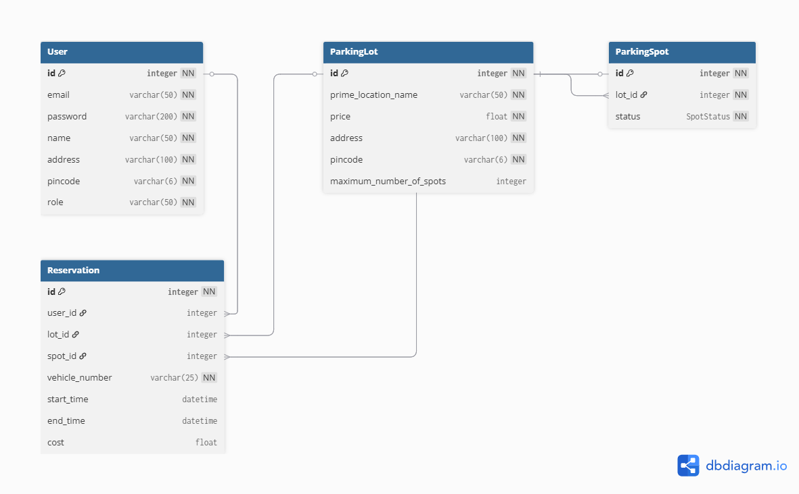

## Vehicle Parking Management App - V1

# Vehicle-Parking-App 
It is a multi-user parking app for 4-wheeler parking

A multi-user Flask-based web application to manage 4-wheeler vehicle parking lots, spots, and user reservations. Built for admin and regular users with easy-to-use interfaces and real-time parking updates.

## Features

### Admin:
- Login as admin
-> Add parking lot
-> Edit/Delete parking lot
-> Add/Delete spot in lot
-> See details of registered user 
-> Search by different fields

### User:
- Register/Login as user
-> Book parking spot
-> release parking spot
-> see parking history with details

## Technologies Used
-> **FLASK**: Backend web framework
-> **SQLAlchemy & Flask-SQLAlchemy**: ORM for database management
-> **SQLite**: Database engine
-> **Bootstrap**: Responsive frontend design
-> **Flask-Dotenv & python-dotenv**: Environment variable management

### How to launch the app:

step1-> set the directory in which all the files are present (ex. cd .\Vehicle-Parking-App\ )
step2-> set the virtual environment (python -m venv venv)
step3->Set-ExecutionPolicy -Scope Process -ExecutionPolicy Bypass (give permission for virtual environment to start)
step4-> .\venv\Scripts\activate  (activate the environment)
step5-> if ur new download the packages from requirement.txt (pip install -r requirement.txt)
step6-> python app.py   (run the app by this)
step7-> after all work done at last close the virtual environment (deactivate)

## Milestones

1. **Database Models and Schema Setup**
Defined models for User, Admin, ParkingLot, ParkingSpot, and Reservation with relationships

2. **Authentication and Role-Based Access**
Implemented user registration/login and predefined admin login with role-based dashboard redirection.

3. **Admin Dashboard and Lot/Spot Management**
Admin can manage lots/spots, auto-generate spots, and view users with their assigned spots.

4. **User Dashboard and Reservation System**
Users can view lots, auto-reserve and release spots, and view parking history.

5. **Reservation History and Summary**
Tracks full reservation history with duration for users and admin.

6. **Slot Time & Cost Calculation**
Calculates parking cost based on time and lot rate, shows details with cost.

7. **Admin Search Functionality**
Admin can search users, resrvations etc.

8. **Frontend & Backend Validation**
Added form validation using HTML/JS and backend validation in Flask.

9. **Responsive UI and Styling**
Used Bootstrap for responsive design across devices.

## 🗃️ Database Schema

### 🧍 User Table

| Column   | Type         | Description |
|----------|--------------|-------------|
| id       | Integer (PK) | Unique identifier |
| email    | String(50)   | Unique user email |
| password | String(200)  | Encrypted password |
| name     | String(50)   | Full name |
| address  | String(100)  | Address (default 'NA') |
| pincode  | String(6)    | PIN code |
| role     | String(50)   | 'user' or 'admin' |

### 🅿️ ParkingLot Table

| Column | Type | Description |
|--------|------|-------------|
| id | Integer (PK) | Primary key |
| prime_location_name | String(50) | Main area name |
| price | Float | Per hour rate |
| address | String(100) | Lot address |
| pincode                 | String(6) | PIN code |
| maximum_number_of_spots | Integer | Max spot capacity |

### 🚗 ParkingSpot Table

| Column | Type         | Description               |
|--------|------        |-------------              |
| id     | Integer (PK) | Spot ID                   |
| lot_id | Integer (FK) | Refers to ParkingLot      |
| status | Enum         | 'AVAILABLE' or 'OCCUPIED' |

### 📅 Reservation Table

| Column         | Type         | Description           |
|--------        |------        |-------------          |
| id             | Integer (PK) | Reservation ID        |
| user_id        | Integer (FK) | Refers to User        |
| lot_id         | Integer (FK) | Refers to ParkingLot  |
| spot_id        | Integer (FK) | Refers to ParkingSpot |
| vehicle_number | String(25)   | User’s vehicle number |
| start_time     | DateTime     | When parking started  |
| end_time       | DateTime     | When parking ended    |
| cost           | Float        | Total cost calculated |

## Folder Structure

D:.
│   .env
│   .gitignore
│   app.py
│   db.py
│   README.md
│   requirement.txt
│
├───instance
│       parking.db
│
├───models
│   │   models.py
│   │   __init__.py
│   │
│   └───__pycache__
│           models.cpython-313.pyc
│           __init__.cpython-313.pyc
│
├───routes
│   │   admin.py
│   │   auth.py
│   │   user.py
│   │   __init__.py
│   │
│   └───__pycache__
│           admin.cpython-313.pyc
│           auth.cpython-313.pyc
│           login.cpython-313.pyc
│           user.cpython-313.pyc
│           __init__.cpython-313.pyc
│
├───static
│   ├───css
│   │       admin_dashboard.css
│   │       baseadmin.css
│   │       baseuser.css
│   │       home.css
│   │
│   └───images
│           avtar.png
│           parked_car.jpg
│           parking_lot.jpg
│
└───templates
    │   baseadmin.html
    │   baseuser.html
    │   home.html
    │   login.html
    │   register.html
    │
    ├───admin
    │       add_spot.html
    │       admin_dashboard.html
    │       create_lot.html
    │       edit_lot.html
    │       lot_details.html
    │       search.html
    │       user_list.html
    │       view_spot.html
    │
    └───user
            book_spot.html
            edit_profile.html
            parking_details.html
            profile.html
            release_spot.html
            user_dashboard.html

## ER-Diagram

